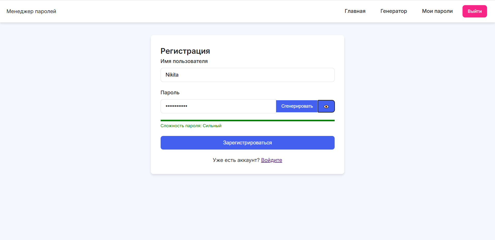

# Password Manager - Flask

Простой и безопасный менеджер паролей с аутентификацией и генерацией сложных паролей.

## Описание функционала

### Главная страница после входа

Главная страница содержит персонализированное приветствие пользователя, отображает статус авторизации и предоставляет доступ к основным функциям, таким как генерация паролей, хранилище паролей и выход из системы. Также присутствуют быстрые ссылки на ключевые разделы.

### Раздел "Мои пароли"

Раздел предоставляет таблицу сохраненных паролей, содержащую название сервиса (например, GitHub), скрытый пароль с возможностью отображения и список доступных действий: показать или скрыть пароль, скопировать его в буфер обмена, а также удалить запись. В этом же разделе находится форма для добавления нового пароля, включающая поля для ввода названия сервиса и самого пароля с возможностью его вставки.

### Генератор паролей

Генератор паролей позволяет настраивать параметры создания пароля, включая его длину (по умолчанию 12 символов) и используемые символы: заглавные буквы, строчные буквы, цифры и специальные символы. После генерации пароля он отображается в отдельном поле с возможностью копирования. Также имеется индикатор сложности пароля.

### Страница регистрации

Страница регистрации содержит форму, включающую поля для ввода имени пользователя и пароля. В процессе ввода отображается индикатор сложности пароля. После заполнения формы пользователь может зарегистрироваться, либо перейти по ссылке на страницу входа, если у него уже есть учетная запись.

### Страница входа

Страница входа содержит форму для авторизации, включающую поля для ввода имени пользователя и пароля, а также кнопку входа. Для новых пользователей предусмотрена ссылка на страницу регистрации.

## Установка и запуск

### Требования
- Python 3.7+
- Git (для клонирования репозитория)

### Шаги установки

1. Клонировать репозиторий:
   ```bash
   git clone https://github.com/1Mantih1/flask-auth-passmanager.git
   cd flask-auth-passmanager
   ```

2. Создать виртуальное окружение и активировать его:
   ```bash
   python -m venv venv
   source venv/bin/activate  # Linux/Mac
   venv\Scripts\activate  # Windows
   ```

3. Установить зависимости:
   ```bash
   pip install -r requirements.txt
   ```

4. Запустить приложение:
   ```bash
   python app.py
   ```